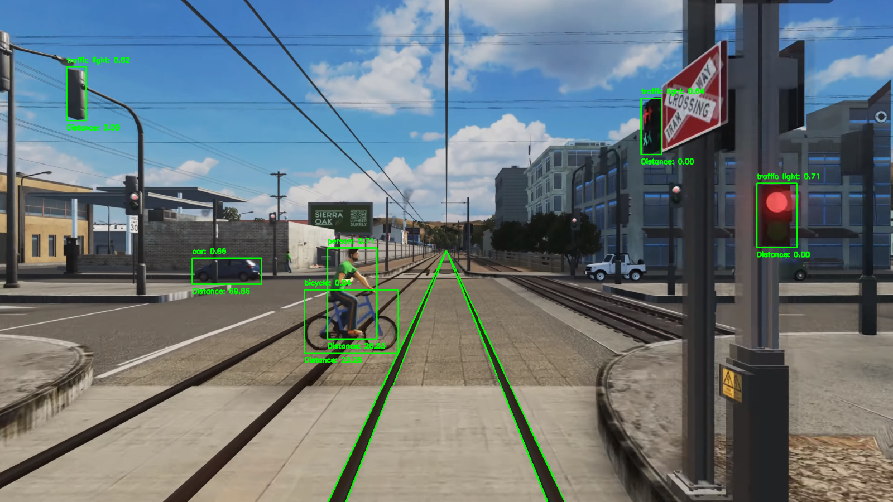

# Intramotev MSU Capstone Project

This repository contains the work for our Michigan State University Data Science capstone project, a collaboration with Intramotev, a technology startup focusing on autonomous freight car manufacturing. The goal of this capstone course is to provide data science students real-world project experience to develop their technical and professional skills. In this project, our team is working alongside Intramotev to develop an accurate object detection system that can be used on footage from their autonomous trains. This object detection was achieved using the You Only Look Once (YOLO) algorithm that uses a combination of provided data with pre-trained data. The team utilized YOLO V8 to analyze video and life-feed footage, adding a bounding box around each object and storing detection results.



# Structure

The structure of the github repository is designed to be as easy to use as possible. In the home directory there are a couple important files. These relate to overall project information such as the installation instructions, the license, and the notebook that can replicate the pictures in our final reports and slides. 

Past that there is a folder called run_files. This folder contains everything needed to run our project (except for an example video). Directly inside the folder you will see three .py files. Their purposes are listed below:

1. run_image.py - Run our project on individual images
2. run_video.py - Run our project on a video
3. run_live.py - Run our project on a live stream from a webcam

Instructions for using them are further in the README. Other folders of note are listed below with their descriptions as well:

1. functions - Contains .py files that contain the necessary classes and functions to execute our main files.
2. inputs - Example images that can be used in our main files.
3. models - Contains the pre-trained YOLO model.
4. output - The resulting figures, videos and csv files from running our main files.

Unless iterating on our design, none of the functions or models should need to be modified. Obviously access to the input and output folders is critical for applying the project to different examples and viewing the results, but other than that, no other files should need to be modified!

# Installation

All packages and required dependencies are included in the provided yml environment. Once this repo is cloned, the environment is created, all files within the repository should be able to run.

[Installation Instructions](install.md)

# Running our Project

You can run our code on both images and videos as you please with varying results. With both inputs, they will detect objects in the frame(s) and then calculate the distance to each of the objects and then save the frame. Details for running are below.

*NOTE* It is important that you ensure the environment you are working in is set up correctly. Follow the instructions in the Installation Instructions and verify example.py is running fine before pursuing the following.

## Images

For images you can simply enter the run_files directory in a terminal and execute the script for an example image provided by us:

```bash
python run_image.py
```

This will take the 'straight_objects.png' image from the inputs folder and process it according to our algorithm. If you want to run the project on one of your own photos, you will need to add the photo to the inputs folder and execute the following with the --i parameter.

```bash
python run_image.py --i 'your_image.png'
```
If your image doesn't have rails in it, then it's not going to work. Our distance calculations relies on having railroad tracks in the image from a POV perspective.

## Running on Videos

Similar to images, you simply need to enter the run_files directory in the terminal and execute the following command.

*NOTE* The default video that run_video.py runs with is not stored in the directory. Due to copyright claims, it is stored in our Teams folders within InOutData/Inputs. File name is "train_clip.mp4." If you don't have access to this, you can simply take a clip from the following video as we did https://www.youtube.com/watch?v=hxxoOj_rrr8&t=59s.

```bash
python run_video.py
```

This will take the 'train_clip.mp4' video from the inputs folder that you should have placed in, and process it according to our algorithm. If you want to run the project on one of your own videos, you will need to add the video to the inputs folder and execute the following with the --i parameter.

```bash
python run_video.py --video 'your_video.mp4'
```

## Running with Webcam

As with images and videos, all you need to do is enter the run_files directory in the terminal and execute the following command.

```bash
python run_live.py
```

It should automatically access your webcam and parse through until you hit 'q' to end the stream and code. Note that unless you magically have a set of rails that works with our algorithm, it won't do a good job (if any) of detecting your distance. However, it will detect objects within the frame. The primary purpose of this code is to prove that our program works with live video and to show off our project with a live demo for presentation to community partners.

# Figure Generation

All figure that are used in any of our write-ups/final results can be generated by you! All our code and documentation can be found in the figure_instructions jupyter notebook. This gives anyone the ability to reproduce our results and verify their accuracy.

[Figure Instructions](figure_instructions.ipynb)

# Miscellaneous

The following is useful information that doesn't fit into the categories above.

## Future Work

The biggest point upon which people can iterate is the detection of the rails. Currently, we have a set of filters designed to detect the lines of the train tracks with a very specific environment (City skylines, sunny, high resolution). Any deviation in angle of the tracks, environment, quality, or intercept of the tracks can mess up the ability of the program to detect the rails. Implementing a better rail detection system would vastly improve the "generalizability" of this project, and increase the likelihood that this project can be applied to the real-world.

## Authors

- Matthew Roberts
- James Fletcher
- Colin Fairbourn
- Aryan Dhar
- Joseph Dougherty

## License

[Apache 2.0](https://www.apache.org/licenses/LICENSE-2.0)

## References

[YOLO V8 Documentation](https://docs.ultralytics.com/)
[Test Video](https://www.youtube.com/watch?v=hxxoOj_rrr8&t=59s)

## Storyboard
2-11 version
https://youtu.be/4qeAWmHQMbM

3-16 version
https://youtu.be/14C2QbaW1KM

4-14 Final version
https://youtu.be/8_zucMSMFVM

## Cities Skylines Simulated Train Video
https://youtu.be/KJfnCSFlxUY

